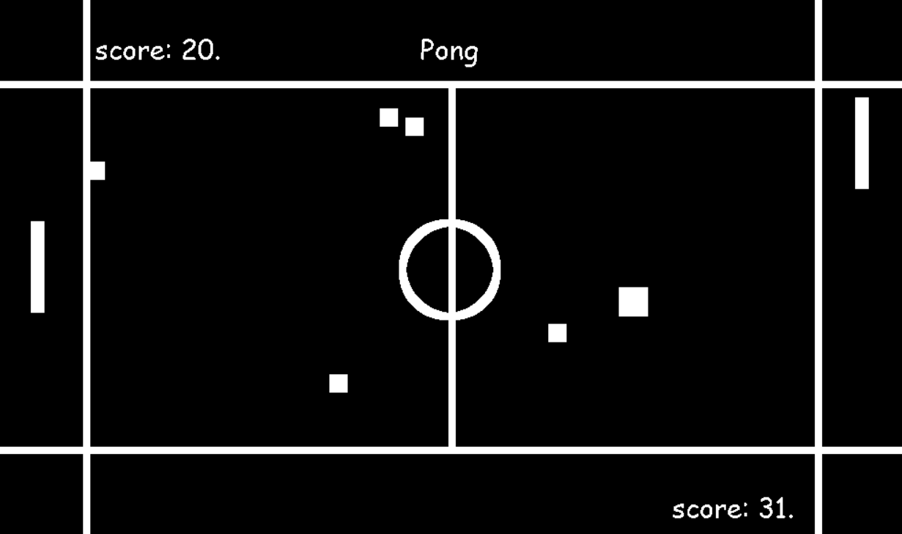

#Jeu de Pong

Ce projet est un jeu de Pong avec une IA développé dans le cadre d'un exercice personnel de programmation.

*Version-1.0*

---

##Installation

Pour exécuter le jeu, vous aurez besoin des bibliothèques suivantes. Vous pouvez les installer en utilisant pip :

bash:

*pip install pygame*
*pip install pandas*
*pip install scikit-learn*

---

##Démarrer le Jeu

Pour lancer le jeu, suivez ces étapes :

1. Ouvrez un terminal.

2. Naviguez jusqu'au répertoire du jeu.

3. Exécutez la commande suivante :

- python pong.py

L'écran d'accueil apparaîtra, et le jeu commencera. Vous contrôlez la raquette de gauche en utilisant les touches flèche haut et flèche bas du clavier.

---

##Auteur

@Verone81

---

## Statut du Projet

Le projet est fonctionnel, mais il manque encore certaines fonctionnalités, telles que la réinitialisation des obstacles dans le jeu, comme les carrés blancs.

---

## Contact

Pour toute question ou commentaire, vous pouvez me contacter à l'adresse e-mail : ueron3@gmail.com

> Vivre et laissez vivre